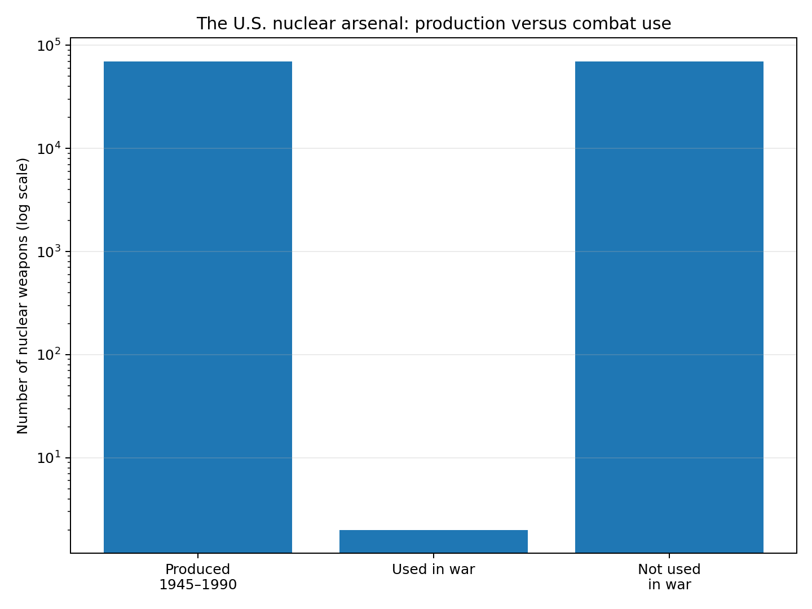
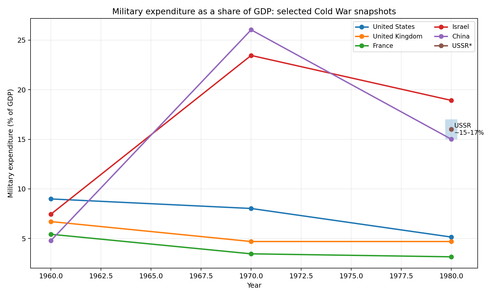

# The Cold War's Price Tag: The Resources Spent on a War That Never Came

> **By: Tanmoy**  
> *A data-driven exploration of military spending, nuclear weapons, proxy wars, industrial resources, disarmament and the opportunity cost of the Cold War.*

---

## Abstract

The Cold War is often remembered as a contest of ideology, diplomacy, espionence, scientific achievement and technological rivalry. It was also an enormous economic mobilisation.

From 1945 onward, the United States alone manufactured **more than 70,000 nuclear weapons**. A historical audit estimated that the U.S. nuclear-weapons enterprise cost **nearly $5.5 trillion in constant 1996 dollars from 1940 through 1996**, including weapons research, production, delivery systems, command and control, testing, environmental remediation and other related activities. Another accounting in *Atomic Audit* puts the acquisition and production of fissile materials plus weapons R&D, testing and manufacturing at about **$409 billion in 1996 dollars** for more than 70,000 weapons. [Brookings](https://www.brookings.edu/books/atomic-audit/) [JSTOR](https://www.jstor.org/stable/10.7864/jj.17497069.7)

The striking question is not simply *"How much did the Cold War cost?"* It is:

> **What else could those resources have produced if a smaller fraction had been devoted to weapons that were never used in combat?**

This article does not assume that all military spending was irrational. Deterrence, defence, alliances and technological development had real strategic purposes. Instead, it measures the **opportunity cost**: the value of factories, scientists, engineers, materials, government revenue and investment committed to military purposes rather than alternative uses.

---

## 1. A necessary warning about the word "waste"

Calling Cold War military expenditure "waste" is partly a value judgement.

A fighter aircraft that never fires a shot may still have provided deterrence. A nuclear warhead that is never detonated may have contributed to strategic stability. A missile submarine that never launches a missile can still be considered successful if its existence prevented an attack.

Therefore this article uses three different categories:

1. **Military expenditure** — what governments actually spent.
2. **Unused armament** — weapons manufactured or maintained but never used in combat.
3. **Opportunity cost** — what the same economic resources might have achieved elsewhere.

This distinction matters. The numbers are much stronger when they are presented as **resources committed to military purposes**, rather than pretending that every un-fired weapon was literally useless.

---

# 2. The scale of the nuclear arms race

## 2.1 More than 70,000 U.S. nuclear weapons

Between 1945 and 1990, the United States produced **more than 70,000 nuclear weapons**. The Brookings *Atomic Audit* estimates that the cost of acquiring and producing fissile materials and carrying out nuclear-weapons research, development, testing and manufacturing was approximately **$409 billion in constant 1996 dollars**. [JSTOR — *Atomic Audit*](https://www.jstor.org/stable/10.7864/jj.17497069.7)

The broader nuclear enterprise cost considerably more.

Brookings estimates:

$$
C_{nuclear,total} \approx \$5.5\text{ trillion}
$$

from 1940 through 1996, in constant 1996 dollars. This larger number includes delivery systems, command and control, intelligence, defence, testing, environmental costs and other nuclear-related activities. [Brookings](https://www.brookings.edu/the-hidden-costs-of-our-nuclear-arsenal-overview-of-project-findings/)

---

## 2.2 Cost per nuclear weapon

Using the narrower $409 billion production-related estimate:

$$
C_{weapon} =
\frac{\$409\text{ billion}}{70,000}
$$

$$
C_{weapon} \approx \$5.84\text{ million}
$$

So the **average production-related expenditure per U.S. nuclear weapon** was approximately:

> **$5.84 million in constant 1996 dollars.**

But this should *not* be interpreted as the retail price of an individual bomb. It is an average allocation of a huge industrial programme containing materials production, R&D, testing and manufacturing.

If we instead spread the **entire $5.5 trillion nuclear programme** over the 70,000 weapons:

$$
\frac{5.5\times10^{12}}{70,000}
\approx \$78.6\text{ million per weapon}
$$

That number includes the enormous infrastructure needed to make the weapons deliverable and survivable.

---

# 3. The remarkable statistic: almost all of them were never used in war

Only **two nuclear weapons have ever been used in warfare**: Hiroshima and Nagasaki in August 1945.

If we compare that with the U.S. production figure:

$$
N_{unused} = 70,000 - 2 = 69,998
$$

Therefore:

$$
\text{Unused share} =
\frac{69,998}{70,000}\times100
\approx 99.997\%
$$

### Result

**Approximately 99.997% of U.S. nuclear weapons produced were never used in combat.**

That does **not** prove that 99.997% of their expenditure was wasted. Deterrence was the principal purpose of the arsenal. But it does demonstrate the extraordinary difference between **production scale** and **combat use**.

If the $409 billion production-related figure is allocated mechanically according to the number produced:

$$
C_{unused} =
409\times\frac{69,998}{70,000}
$$

$$
C_{unused} \approx \$408.99\text{ billion}
$$

So the production programme corresponds to roughly **$409 billion in 1996 dollars associated with weapons that were never fired in combat**.

Again, this is an accounting allocation—not a claim that the weapons had no strategic value.

---

# 4. The stockpile did not disappear for free

When the Cold War ended, the world did not simply switch off its nuclear weapons.

Thousands of weapons had to be:

- removed from deployment,
- transported,
- guarded,
- separated from delivery systems,
- dismantled,
- stored,
- processed for material recovery,
- and in some cases followed by environmental remediation.

The **Nunn–Lugar Cooperative Threat Reduction (CTR)** programme became one of the major mechanisms for reducing the former Soviet arsenal.

The Lugar archives record that during the first decade of Nunn–Lugar, more than **7,000 nuclear warheads and ballistic/cruise missiles had been eliminated**. [Lugar archive](https://collections.libraries.indiana.edu/lugar/items/show/214)

By 2004, U.S. government reporting listed **6,312 nuclear warheads** among systems deactivated or destroyed under the programme, along with hundreds of missiles, launchers, bombers and submarines. [U.S. State Department archive](https://usinfo.org/wf-archive/2004/040811/epf302.htm)

---

# 5. How much did destroying nuclear weapons cost?

This is one of the hardest numbers to calculate accurately.

The cost of **dismantling a warhead itself** is not the same as the total cost of a disarmament programme.

A Belfer Center analysis cited Russian officials who estimated the direct cost of dismantling one warhead at approximately:

$$
C_{dismantle} \approx \$15,000
$$

If that estimate is applied to 7,000 warheads:

$$
7,000\times\$15,000
=
\$105\text{ million}
$$

So a simple direct-dismantling estimate gives:

> **≈ $105 million for dismantling 7,000 warheads.**

This is *not* the full cost of eliminating the arsenal. Transportation, security, missile destruction, storage, verification, material disposition and environmental work add substantially to the bill. [Belfer Center](https://www.belfercenter.org/publication/reducing-threat-nuclear-theft)

Indeed, the U.S. Government Accountability Office reported that Congress had provided about **$1.5 billion for CTR activities in FY1992–96**, with much of the money going to delivery-vehicle and infrastructure dismantlement, nuclear-material controls and other threat-reduction activities rather than warhead dismantlement alone. [GAO](https://www.globalsecurity.org/wmd/library/report/gao/nsi96222.htm)

---

## 5.1 The strange economic contrast

Consider the following two numbers:

**Estimated U.S. production-related cost per weapon:**

$$
\approx \$5.84\text{ million}
$$

**Russian estimate of direct dismantlement cost per warhead:**

$$
\approx \$15,000
$$

The ratio is:

$$
\frac{5.84\text{ million}}{15,000}
\approx 389
$$

In other words, under these two very different accounting definitions, the historical U.S. production allocation per weapon was roughly **390 times larger** than the cited direct dismantlement estimate.

That does **not** mean building a bomb costs 390 times more than destroying one in every country. It demonstrates how different the accounting scopes are.

---

# 6. What was the "value" of the demolished Soviet stockpile?

There is no reliable public number that lets us say:

> "The Soviet Union spent exactly X dollars producing the 7,000 warheads later dismantled."

Soviet military accounting was secretive and used a non-market rouble system. SIPRI itself has repeatedly warned that Soviet military-spending estimates are highly uncertain. [SIPRI](https://www.sipri.org/commentary/blog/2016/65-years-military-spending)

But we can make an **illustrative comparison**.

If the U.S. production-related average of $5.84 million per weapon were mechanically applied to 7,000 weapons:

$$
7,000\times\$5.84\text{ million}
\approx \$40.9\text{ billion}
$$

That is **not the historical Soviet cost**.

It is an answer to a different question:

> *What would 7,000 weapons represent if they had the same average production-resource intensity as the U.S. programme?*

The distinction is important.

---

# 7. The Cold War was much larger than nuclear weapons

Nuclear weapons were only one part of the military economy.

Governments also funded:

- tanks,
- aircraft,
- ships,
- submarines,
- artillery,
- missiles,
- ammunition,
- radar,
- military satellites,
- military communications,
- intelligence systems,
- military bases,
- civil defence,
- research laboratories,
- nuclear reactors,
- chemical and biological weapons programmes,
- and enormous standing armies.

SIPRI's historical work shows that by the end of the Cold War the **United States and Soviet Union accounted for approximately 36% and 20% respectively of world military spending**. [SIPRI](https://www.sipri.org/sites/default/files/YB06%20269%2007.pdf)

The global military economy therefore cannot be reduced to the nuclear arsenal.

---

# 8. How much industrial output was diverted?

There is an important terminology problem here.

A country did not literally "waste X% of industrial output." Military spending is normally measured as a share of **GDP, government expenditure or national product**.

So the scientifically safer question is:

> **What percentage of economic output was directed toward military purposes?**

SIPRI's definition includes personnel, operations and maintenance, procurement, military R&D, infrastructure and military aid. It can therefore be used as a proxy for the economic resources committed to defence. [SIPRI](https://www.sipri.org/databases/milex)

---

## 8.1 United States

Selected historical values from the SIPRI/World Bank series:

| Year | Military expenditure / GDP |
|---:|---:|
| 1960 | 8.99% |
| 1970 | 8.03% |
| 1980 | 5.15% |
| 1984 | 6.24% |

Source: historical military-expenditure series derived from SIPRI/World Bank data. [World Bank-derived series](https://www.indexmundi.com/facts/united-states/indicator/MS.MIL.XPND.GD.ZS)

At the height of the Cold War, the United States was therefore directing several percentage points—and in some years close to a tenth—of national economic output toward military expenditure.

---

## 8.2 United Kingdom

The British burden was also substantial.

UK parliamentary records show defence expenditure as a percentage of GDP of:

- **7.1% in 1955–56**
- **6.1% in 1960–61**
- **4.7% in 1980–81**
- **5.0% in 1983–84**

[UK Parliament](https://publications.parliament.uk/pa/cm201516/cmselect/cmdfence/494/49409.htm)

Even more strikingly, defence represented roughly **19–27% of total government expenditure during much of the 1950s**, according to a contemporary parliamentary answer. [Hansard](https://hansard.parliament.uk/Commons/1981-04-07/debates/cc248ffd-1e2f-454e-967f-547f796eaa7d/DefenceExpenditure)

That means roughly **one pound out of every four or five pounds of government expenditure** could be going to defence in some early Cold War years.

---

## 8.3 Soviet Union

The Soviet case is more difficult.

The Soviet government classified economic information differently and military spending was heavily concealed. SIPRI's 1988 review discussed evidence that Soviet military spending amounted to roughly **15–17% of GNP in the early 1980s**. [SIPRI Yearbook 1988](https://www.sipri.org/sites/default/files/SIPRI%20Yearbook%201988.pdf)

That is enormous.

If a country directs approximately 16% of its economic output toward the military, then—very roughly—**one-sixth of measured economic production is being committed to defence-related activity**.

The exact Soviet figure remains debated, so **15–17% should be treated as an estimate/range rather than a precise statistic**.

---

## 8.4 France

France provides a useful comparison because it had a large military establishment but a much lower burden than the superpowers.

SIPRI-derived figures show:

| Year | France |
|---:|---:|
| 1960 | 5.43% |
| 1970 | 3.46% |
| 1980 | 3.16% |
| 1984 | 3.19% |

[Historical SIPRI series](https://www.indexmundi.com/facts/france/indicator/MS.MIL.XPND.GD.ZS)

---

## 8.5 Israel

Some states involved directly in Cold War conflicts carried dramatically higher military burdens.

Israel's military expenditure reached:

- **15.44% of GDP in 1967**
- **23.45% in 1970**
- **27.86% in 1973**
- **18.92% in 1980**

[SIPRI-derived historical series](https://www.indexmundi.com/facts/israel/indicator/MS.MIL.XPND.GD.ZS)

These figures show why a simple statement such as "the Cold War wasted resources" cannot be applied uniformly. For countries facing active wars and existential security threats, military spending represented a very different economic calculation.

---

## 8.6 China

China's historical figures are especially difficult because its accounting system and data availability changed dramatically.

A SIPRI historical table gives Chinese military expenditure at **4.8% of national material product in 1960**. Later estimates show a much higher burden in the 1970s and early 1980s. [SIPRI Yearbook 1991](https://www.sipri.org/sites/default/files/SIPRI%20Yearbook%201991.pdf)

An OWID/SIPRI-derived historical series gives approximately:

- **26.0% in 1970**
- **15.0% in 1980**

These numbers should be treated carefully because historical Chinese national accounting changed substantially. They are useful for showing the *scale* of military mobilisation, not as perfectly comparable modern GDP statistics.

---

---

# 9. The wars themselves

The Cold War was "cold" primarily between the superpowers. It was not cold for millions of people elsewhere.

Korea, Vietnam, Afghanistan, Angola, the Middle East, Central America and numerous African and Asian conflicts became theatres of the wider confrontation.

## 9.1 Korea

A Congressional Research Service estimate places the U.S. cost of the Korean War at approximately:

$$
\$341\text{ billion}
$$

in constant FY2011 dollars.

## 9.2 Vietnam

The same CRS series estimates:

$$
\$738\text{ billion}
$$

in constant FY2011 dollars for U.S. military operations in Vietnam.

Therefore:

$$
341 + 738 = \$1.079\text{ trillion}
$$

So the **Korean and Vietnam wars alone correspond to roughly $1.08 trillion in constant FY2011 U.S. military-operation costs**.

These are U.S. costs—not the total economic destruction suffered by Vietnam, Korea or other participants. [CRS](https://www.everycrsreport.com/reports/RS22926.html)

---

# 10. The Soviet war in Afghanistan

The Soviet-Afghan War gives us another perspective.

A U.S. government analysis estimated that from late 1979 through 1986 the USSR spent approximately:

$$
15\text{ billion roubles}
$$

on direct conduct of the war.

Converted using U.S. resource prices, the study estimated approximately:

$$
\$48\text{ billion}
$$

in **1984-dollar-equivalent costs** for 1980–86. [U.S. government historical analysis](https://nsarchive2.gwu.edu/NSAEBB/NSAEBB57/us8.pdf)

Of this direct Soviet cost estimate, the study allocated approximately:

- 19% personnel
- 30% operations and maintenance
- 49% procurement

The procurement component alone therefore represented a major resource drain.

---

# 11. Armaments that were never fired

There are several ways to interpret "unused armaments."

### Nuclear weapons

This is the clearest case.

Of the more than 70,000 U.S. nuclear weapons manufactured between 1945 and 1990:

$$
\approx 99.997\%
$$

were never used in combat.

### Conventional weapons

The situation is much harder to quantify.

A tank sitting in a warehouse, an aircraft used for deterrence, ammunition held in reserve, or a missile never launched cannot simply be labelled "wasted."

Those weapons were often deliberately purchased **because they were not supposed to be used**.

This is the paradox of deterrence:

> The economic value of a weapon may come from the fact that it never has to be fired.

---

# 12. The industrial opportunity cost

The military-industrial system consumed much more than money.

It consumed:

### Materials

Steel, aluminium, titanium, copper, uranium, plutonium, rare materials, petroleum and industrial chemicals.

### Human capital

Scientists, engineers, technicians, programmers, mathematicians and skilled manufacturing workers.

### Industrial capacity

Factories designed around military contracts could instead have produced civilian machinery, transport equipment, infrastructure or consumer goods.

### Research capacity

Huge laboratories worked on nuclear physics, rocketry, guidance, materials science, electronics and communications.

Some of these technologies later generated enormous civilian benefits.

Therefore, the correct conclusion is **not** that military R&D produced no value.

Rather:

> **The Cold War created a huge opportunity cost while simultaneously producing major technological spillovers.**

---

# 13. What if even a fraction had gone into space research?

This is where the counterfactual becomes fascinating.

The Apollo programme is a useful benchmark.

NASA reports that the Apollo programme and related lunar programme activities cost roughly **$30 billion by FY1975**, while the historically reported Project Apollo figure is commonly given as about **$25.4 billion**. [NASA](https://www.nasa.gov/)

Using the reported $25.4 billion Project Apollo figure purely as a scale comparison:

### U.S. nuclear production-related programme

$$
\frac{409}{25.4}
\approx 16.1
$$

The production-related nuclear cost alone corresponds to approximately:

> **16 Apollo programmes**

in raw historical-dollar terms.

The broader $5.5 trillion nuclear programme gives:

$$
\frac{5500}{25.4}
\approx 216.5
$$

That corresponds to approximately:

> **216 Apollo programmes**

Again, this is a **scale comparison, not an inflation-adjusted investment model**. The underlying dollars come from different historical accounting periods.

---

# 14. A more meaningful counterfactual

Suppose only **10%** of the $409 billion nuclear production-related cost had instead been allocated to scientific and civilian space research:

$$
0.10\times409
=
\$40.9\text{ billion}
$$

That would be enough to fund approximately:

$$
\frac{40.9}{25.4}
\approx 1.61
$$

historical Apollo-scale programmes.

Now imagine reallocating 10% of the broader $5.5 trillion nuclear enterprise:

$$
0.10\times5,500
=
\$550\text{ billion}
$$

At the reported historical Apollo cost:

$$
\frac{550}{25.4}
\approx 21.7
$$

Apollo-scale programmes.

This does **not** mean that the United States could literally have built 21 Moon programmes. Space programmes have diminishing returns, different technical constraints and different historical costs.

But it illustrates the scale of the opportunity.

---

# 15. What about the cost of war itself?

Consider only Korea and Vietnam:

$$
C_{Korea+Vietnam}
=
341+738
=
\$1.079\text{ trillion}
$$

If merely **1%** of that expenditure had been redirected:

$$
0.01\times1.079\text{ trillion}
=
\$10.79\text{ billion}
$$

That is already a substantial scientific programme.

At **5%**:

$$
0.05\times1.079\text{ trillion}
=
\$53.95\text{ billion}
$$

At **10%**:

$$
0.10\times1.079\text{ trillion}
=
\$107.9\text{ billion}
$$

The numbers become enormous surprisingly quickly.

---

# 16. The central lesson

The Cold War did not simply destroy money.

It transformed money into:

> **factories + weapons + laboratories + armies + missiles + ships + aircraft + nuclear materials + bases + research programmes + standing forces.**

Much of that expenditure was intentional.

The important economic question is therefore:

$$
\boxed{\text{Opportunity Cost}
=
\text{Military Resources}
-
\text{Alternative Civilian Uses}}
$$

The counterfactual is impossible to know exactly.

If the Cold War had not existed, governments would not automatically have transferred every military dollar into hospitals, schools or spacecraft.

Politics would have changed.

Taxation would have changed.

Consumer demand would have changed.

Technology would have changed.

Inflation and interest rates would have changed.

So the best conclusion is not:

> "The Cold War cost X, therefore society lost exactly X."

Instead:

> **The Cold War created an enormous diversion of economic resources whose alternative uses could have been extraordinarily valuable.**

---

# 17. The final accounting

| Item | Historical / calculated figure |
|---|---:|
| U.S. nuclear weapons produced, 1945–1990 | **70,000+** |
| U.S. nuclear weapons used in warfare | **2** |
| Approx. share never used in combat | **99.997%** |
| U.S. nuclear production/R&D/testing/manufacturing cost | **≈ $409B (1996 $)** |
| Implied average production-related cost/weapon | **≈ $5.84M (1996 $)** |
| Broader U.S. nuclear programme, 1940–1996 | **≈ $5.5T (1996 $)** |
| Implied broader programme cost/weapon | **≈ $78.6M** |
| Example: 7,000 warheads × $15,000 dismantlement estimate | **≈ $105M** |
| Korean War, U.S. operations | **≈ $341B (FY2011 $)** |
| Vietnam War, U.S. operations | **≈ $738B (FY2011 $)** |
| Korea + Vietnam | **≈ $1.079T (FY2011 $)** |
| Soviet-Afghan War direct estimate, 1980–86 | **≈ $48B (1984-dollar equivalent)** |
| Apollo programme historical reported cost | **≈ $25.4B** |

---

# 18. The bigger picture

The Cold War was an extraordinary demonstration of what modern industrial states can do when they believe their survival is at stake.

The United States and Soviet Union created military systems on a scale capable of destroying civilisation many times over. Other countries were pulled into the competition, either through alliances, proxy conflicts or their own security dilemmas.

The paradox is that **the most successful nuclear weapon may have been the one that was never fired**.

But that success came at a price.

Tens of thousands of nuclear weapons were manufactured. Vast numbers of conventional weapons were produced. Entire industries were reorganised around military requirements. Scientists and engineers were recruited into defence laboratories. Countries devoted substantial fractions of their economic output to defence.

And after all that production, the post-Cold War world had to spend additional money **destroying what it had previously paid to build**.

That is the economic irony at the heart of the Cold War:

> **Humanity spent enormous resources preparing for a war whose greatest victory was that it never happened.**

The question for the future is therefore not whether every defence expenditure was wasteful.

It is whether future generations can obtain the **security benefits of deterrence with substantially fewer resources**, freeing more capital, scientific talent and industrial capacity for exploration, health, infrastructure, education, energy and other peaceful objectives.

---

# 19. Methodology and limitations

### Dollar values are not directly interchangeable

This article deliberately preserves the original dollar bases:

- Nuclear programme: **constant 1996 dollars**
- Korea/Vietnam: **constant FY2011 dollars**
- Soviet Afghanistan estimate: **1984-dollar equivalent**
- Apollo: **historical reported programme cost**

Therefore, the Apollo comparisons are **scale illustrations**, not rigorous real-dollar investment comparisons.

### "Military burden" is not "industrial waste"

Military expenditure as a percentage of GDP tells us how much economic output was allocated to military purposes. It does **not** tell us that the same percentage was physically wasted.

### Soviet figures are uncertain

Soviet military expenditure was secretive and different researchers produced different estimates. The 15–17% early-1980s figure should be treated as an estimate.

### War costs are not total social costs

The CRS-style war figures primarily measure military operations. They do not fully capture:

- civilian deaths,
- destroyed infrastructure,
- lost education,
- lost earnings,
- environmental damage,
- veterans' long-term costs,
- interest on war debt,
- displaced populations,
- or lost economic growth.

Consequently, **the true social cost of Cold War conflicts was much larger than the military-budget numbers alone**.

---

# 20. Conclusion

The Cold War was not simply a contest between capitalism and communism.

It was also the largest sustained mobilisation of industrial, scientific and financial resources in modern history outside the world wars.

The numbers tell a striking story:

**70,000+ U.S. nuclear weapons produced.**

**2 used in war.**

**≈ $409 billion spent on U.S. nuclear production-related activities.**

**≈ $5.5 trillion spent on the wider U.S. nuclear enterprise.**

**Thousands of Soviet warheads subsequently dismantled.**

**Hundreds of billions spent on Korea and Vietnam.**

**Large fractions of national output devoted to military purposes.**

And after the confrontation ended, governments still had to spend additional resources cleaning up and dismantling the machinery of deterrence.

The most useful lesson is therefore not simply that weapons are expensive.

It is that **security has an opportunity cost**.

Every scientist assigned to a weapons laboratory is a scientist not working somewhere else.

Every factory producing a missile is a factory not producing something else.

Every billion spent maintaining a stockpile is a billion that could have been invested elsewhere.

The challenge for future generations is to preserve security while reducing that opportunity cost.

---

## Data files

The accompanying CSV files contain the numerical datasets used for the tables and graphs:

- [`military_burden_selected.csv`](military_burden_selected.csv)
- [`war_costs_selected.csv`](war_costs_selected.csv)
- [`nuclear_cost_calculations.csv`](nuclear_cost_calculations.csv)

## Graphs

- [`military_burden.png`](military_burden.png)
- [`nuclear_used_vs_unused.png`](nuclear_used_vs_unused.png)
- [`selected_costs.png`](selected_costs.png)

---

## Sources and further reading

1. Stephen I. Schwartz, *Atomic Audit: The Costs and Consequences of U.S. Nuclear Weapons Since 1940*, Brookings Institution Press.  
   https://www.brookings.edu/books/atomic-audit/

2. Brookings — *The Hidden Costs of Our Nuclear Arsenal*.  
   https://www.brookings.edu/the-hidden-costs-of-our-nuclear-arsenal-overview-of-project-findings/

3. SIPRI Military Expenditure Database.  
   https://www.sipri.org/databases/milex

4. SIPRI historical yearbooks.  
   https://www.sipri.org/yearbook

5. U.S. Congressional Research Service — *Costs of Major U.S. Wars*.  
   https://www.everycrsreport.com/reports/RS22926.html

6. U.S. government historical analysis of the costs of Soviet military operations in Afghanistan.  
   https://nsarchive2.gwu.edu/NSAEBB/NSAEBB57/us8.pdf

7. Richard G. Lugar Senatorial Papers — Nunn–Lugar dismantlement.  
   https://collections.libraries.indiana.edu/lugar/items/show/214

8. Belfer Center — *Reducing the Threat of Nuclear Theft*.  
   https://www.belfercenter.org/publication/reducing-threat-nuclear-theft

9. U.S. Government Accountability Office — Cooperative Threat Reduction.  
   https://www.gao.gov/assets/a246915.html

10. UK Parliament — Historical defence expenditure.  
    https://publications.parliament.uk/pa/cm201516/cmselect/cmdfence/494/49409.htm

11. NASA — Apollo historical programme information.  
    https://www.nasa.gov/

---

*Prepared as a historical-economic analysis. Figures are rounded where appropriate; estimates and counterfactual calculations are explicitly identified as such.*
