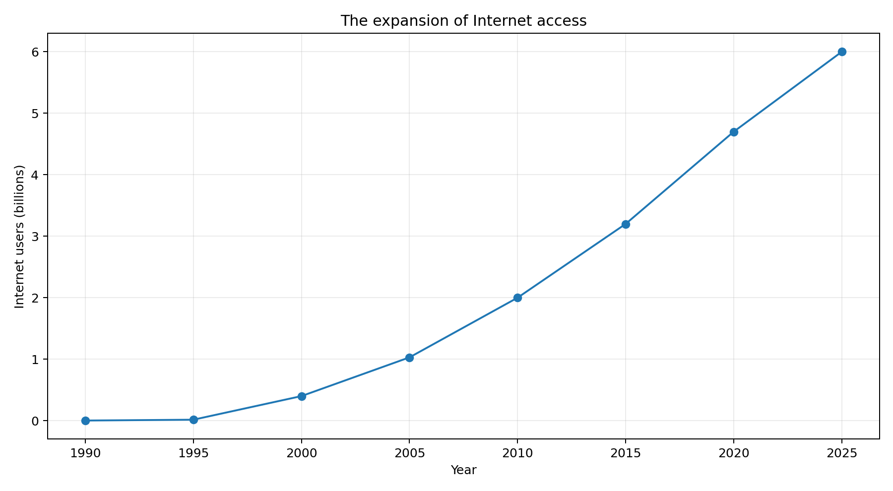
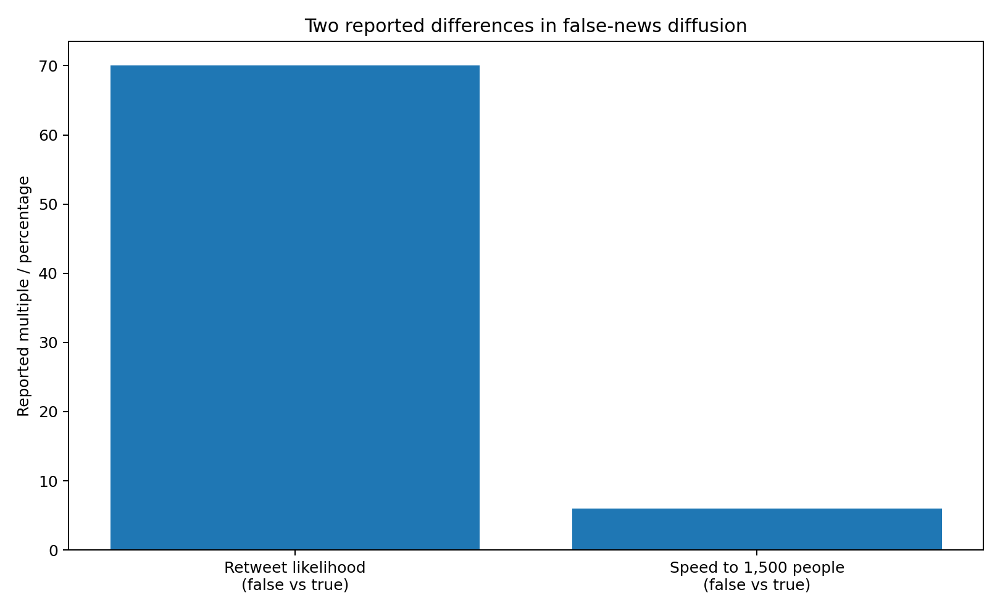

# The Information Paradox

## When everyone can write, who can we believe?

For most of human history, information was expensive.

Not necessarily because knowledge itself was rare, but because **turning knowledge into something reproducible and distributable required effort**.

A manuscript had to be copied. A book had to be printed. A newspaper had to be typeset, printed and transported. Distribution imposed friction.

That friction was not a guarantee of truth. Books could be wrong. Newspapers could publish propaganda. Scholars could make mistakes.

But there was a bottleneck.

Then humanity spent several centuries removing it.

The printing press reduced the cost of reproducing text. Industrial publishing reduced it further. Computers reduced the cost of manipulating information. Networks reduced the cost of moving it.

The Internet ultimately made global digital distribution almost trivial.

And generative AI is now reducing another bottleneck: the human effort required to create polished text, images, audio and video.

This creates a historical paradox:

> **The technologies that made knowledge abundant also made plausible falsehood abundant.**

The problem is not that the Internet stopped being useful.

It is that **finding information and knowing that information is true have become increasingly different tasks.**

---

# 1. Before the Internet: the cost of publishing was itself a filter

Imagine writing a serious book in 1920.

You needed an author, manuscript preparation, editing, typesetting, printing, paper, binding, distribution and a publisher willing to take the economic risk.

A bad idea could certainly make it into print.

But publishing was not free.

We can think of the rough cost of publishing as a function:

\[
C_{\mathrm{publish}}
=
C_{\mathrm{author}}
+C_{\mathrm{editing}}
+C_{\mathrm{production}}
+C_{\mathrm{distribution}}
\]

The exact values are historical and vary enormously by technology and market, but the structure matters.

If \(C_{\mathrm{publish}}\) is high, fewer people publish.

If \(C_{\mathrm{publish}}\) falls, more people publish.

That is an enormous social gain.

It is also the beginning of our problem.

---

# 2. The printing revolution

The printing press changed the economics of information.

The important transformation was not simply that books became easier to make.

It was that **the marginal cost of reproducing an existing piece of information fell dramatically compared with hand copying**.

That helped create conditions for the expansion of literacy, scientific communication, religious debate, political argument and education.

But the printing press did not create a world without misinformation.

It created a world in which **both knowledge and misinformation could be reproduced more efficiently**.

This is the pattern we will see repeatedly.

> Lower the cost of communication and you lower the cost of communicating bad information too.

---

# 3. Then computers changed what “information” meant

The computer introduced another profound change.

Information no longer had to exist primarily as a physical object.

A document could become bits.

A photograph could become bits.

A scientific dataset could become bits.

A program could become bits.

Once information becomes digital, copying it can be extraordinarily cheap.

The physical economics of information begin to disappear.

The question changes from:

> “How many copies can we afford to print?”

to:

> “How many people can we transmit this to?”

And that leads directly to networking.

---

# 4. ARPANET: the beginning of a networked information world

The popular story sometimes goes:

> “The U.S. Department of Defense connected computers and invented the Internet.”

The actual history is more interesting.

ARPA research in the 1960s played a central role in the development of ARPANET. The first ARPANET network had four nodes, and the first computer-to-computer signal was sent between UCLA and the Stanford Research Institute on October 29, 1969. DARPA describes packet switching and later TCP/IP development as important steps in the evolution toward today's Internet.

DARPA's historical account describes ARPANET as a pioneering network for sharing digital resources between geographically separated computers.

> “ARPANET began with four computer nodes.”

— DARPA, *ARPANET*

The four original nodes were UCLA, the Stanford Research Institute, UC Santa Barbara and the University of Utah.

The important idea was not simply connecting four computers.

It was creating a system in which computers separated by geography could exchange digital information.

That sounds ordinary now.

At the time, it was revolutionary.

---

# 5. From network to Internet

ARPANET was not the finished Internet.

A major problem was interoperability: different networks and computers needed a common way to communicate.

Robert Kahn and Vint Cerf worked on what became TCP/IP.

DARPA describes TCP/IP as a foundational communications architecture for sending packets across interconnected networks.

In January 1983, enough networks had become interconnected that ARPANET had evolved into what DARPA describes as the Internet.

The network was no longer simply one network.

It was becoming a **network of networks**.

That distinction is crucial.

Because once networks could interoperate, the potential scale of information exchange changed dramatically.

---

# 6. The Internet's greatest achievement: abundance

The Internet is sometimes discussed primarily as a communications technology.

That undersells it.

It is also an enormous **knowledge-access system**.

A student can read a university lecture from another continent.

A programmer can consult documentation written by someone thousands of kilometres away.

A researcher can download datasets.

A person can access historical archives.

A teacher can distribute material to hundreds of students without printing hundreds of books.

The World Bank/ITU data used by Our World in Data define an Internet user as someone who has used the Internet within the previous three months. The current dataset spans 1990–2025.

**Figure 1. Internet users, rounded snapshot.**

The underlying data source is:

- International Telecommunication Union (ITU), via World Bank
- Our World in Data processing
- Dataset updated July 27, 2026
- Coverage: 1990–2025

Source:
https://ourworldindata.org/grapher/number-of-internet-users

The values in `data/internet_users_rounded.csv` are intentionally rounded for the accompanying graphic. For a publication that requires exact statistical values, download the current CSV from the source above and regenerate the figure.

The transformation is extraordinary.

The Internet turned geographical distance into a much smaller barrier to information.

---

# 7. From “Where is the information?” to “Which information is trustworthy?”

This is where abundance changes the problem.

When information was scarce, the problem was often:

\[
\text{Find information}
\]

When information becomes abundant, the problem becomes:

\[
\text{Find relevant information}
\]

And with misinformation:

\[
\text{Find relevant, accurate information}
\]

That last step is much more expensive.

Suppose a claim takes one minute to create.

Checking it might require:

- finding the original source,
- checking the date,
- reading the underlying paper,
- inspecting methodology,
- checking the context,
- comparing independent sources,
- checking whether the statistic was misquoted,
- looking for contradictory evidence.

So we can define a simple conceptual ratio:

\[
G =
\frac{C_{\mathrm{verify}}}
{C_{\mathrm{produce}}}
\]

Call \(G\) the **verification gap**.

This is not a standard scientific metric; it is a conceptual model for thinking about the problem.

If:

\[
G \gg 1
\]

then creating claims is much cheaper than verifying them.

That asymmetry is potentially one of the defining characteristics of the modern information environment.

---

# 8. Social media changed the equation again

The Web made everyone capable of publishing.

Social media made everyone capable of broadcasting.

That distinction is enormous.

A personal website might have ten readers.

A social platform can distribute a post to thousands or millions.

The information system therefore changed from:

\[
\text{Publisher} \rightarrow \text{Audience}
\]

toward:

\[
\text{Everyone} \rightarrow \text{Everyone}
\]

The number of possible communication pathways exploded.

But reach and truth are not the same variable.

A statement can be highly shareable without being accurate.

And this is where empirical research becomes important.

---

# 9. False information can have a diffusion advantage

One of the most important studies on online misinformation was published by Soroush Vosoughi, Deb Roy and Sinan Aral in *Science* in 2018.

The researchers examined approximately **126,000 news stories**, tweeted by approximately **3 million people** more than **4.5 million times**, covering Twitter activity from 2006 to 2017.

They classified stories using six independent fact-checking organisations, whose classifications showed 95–98% agreement.

Their conclusion was unusually striking:

> “Falsehood diffused significantly farther, faster, deeper, and more broadly than the truth.”

— Vosoughi, Roy & Aral, *Science* (2018)

The study also reported that false news was **70% more likely to be retweeted** than true news, and that false news reached 1,500 people roughly **six times faster**.

**Figure 2. Two reported differences in false-news diffusion.**

The study also found that false stories tended to be more novel, and that the emotional reactions surrounding them differed from those surrounding true stories.

Importantly, the authors did not conclude that bots alone caused the phenomenon. Their analysis found that bots accelerated true and false news at similar rates, suggesting that human behaviour played an important role in the greater diffusion of falsehoods.

Source:
https://pubmed.ncbi.nlm.nih.gov/29590045/

DOI:
https://doi.org/10.1126/science.aap9559

---

# 10. The crucial distinction: misinformation is not one thing

It is useful to distinguish:

### Misinformation

False or misleading information shared without necessarily knowing it is false.

### Disinformation

False or misleading information deliberately produced or spread to deceive.

### Malinformation

Genuine information used in a misleading or harmful context.

These categories matter because the technology problem is not simply:

\[
\text{AI} \rightarrow \text{lies}
\]

It is closer to:

\[
\text{AI}
+
\text{cheap production}
+
\text{network distribution}
+
\text{human psychology}
\rightarrow
\text{new information dynamics}
\]

---

# 11. And then came generative AI

Generative AI changes the production side of the equation.

Before generative AI, creating convincing media could require specialised skills.

A realistic image might require photography, actors, editing and compositing.

A convincing voice recording might require a voice actor and audio engineering.

A polished article might require a writer and editor.

Generative AI can compress parts of these workflows into prompts and automated systems.

That does not mean AI-created information is automatically false.

In fact, generative AI can also help with education, translation, accessibility, summarisation and scientific communication.

Nature Reviews Physics has noted this dual role: generative AI may democratise science communication while its outputs still require expert checking and can also be used to create misinformation.

> “their output must be checked by experts.”

— Biyela et al., *Nature Reviews Physics* (2024)

Source:
https://www.nature.com/articles/s42254-024-00691-7

---

# 12. AI does not need to create most misinformation to change the system

This is an important point.

It would be a mistake to assume that the future requires the Internet to become mostly AI-generated.

It doesn't.

If AI reduces the cost of producing content by a factor of \(k\), then even a relatively small fraction of malicious or careless users could produce much more content.

Conceptually:

\[
N_{\mathrm{content}}
\propto
\frac{H}{C_{\mathrm{production}}}
\]

where:

- \(N_{\mathrm{content}}\) = amount of content produced,
- \(H\) = available human/organizational effort,
- \(C_{\mathrm{production}}\) = cost per unit of content.

As \(C_{\mathrm{production}}\) falls, potential output rises.

The problem is that the corresponding verification capacity may not scale at the same rate.

---

# 13. The verification bottleneck

Consider two hypothetical processes.

### Content creation

\[
1\text{ person}
\xrightarrow{\mathrm{AI}}
1000\text{ drafts}
\]

### Verification

\[
1\text{ expert}
\xrightarrow{\mathrm{careful\ checking}}
10\text{ claims}
\]

These numbers are **illustrative**, not measured estimates.

But the structural problem is real:

> **Generation can be automated much more easily than verification of every underlying claim.**

A language model can generate a paragraph instantly.

Determining whether every factual statement in that paragraph is correct may require external evidence.

This is why an apparently simple AI-generated answer can hide a large verification workload.

---

# 14. AI itself can produce false information

There is another layer to the problem.

Generative AI does not only make it cheaper for humans to create misinformation.

AI systems themselves can produce incorrect statements.

Researchers commonly refer to these as hallucinations: outputs that are presented fluently but are false, unsupported or otherwise unreliable.

A 2024 *Nature* paper on semantic entropy described large language models as systems that can produce false outputs and proposed a method for detecting uncertainty associated with hallucinated answers.

Source:
https://www.nature.com/articles/s41586-024-07421-0

A 2024 review in *Nature Machine Intelligence* similarly described a growing challenge around factuality and the use of LLMs to produce convincing false content at scale.

Source:
https://www.nature.com/articles/s42256-024-00881-z

This produces a strange feedback loop:

\[
\text{Human misinformation}
\rightarrow
\text{training data}
\rightarrow
\text{AI output}
\rightarrow
\text{new content}
\rightarrow
\text{future information environment}
\]

The exact effects of such feedback loops are an active research question, rather than a settled fact.

---

# 15. The Indian example is especially interesting

India provides an unusually useful case study because of its enormous and diverse digital population.

A 2024 *Nature* article reported on research examining roughly two million WhatsApp messages from users in rural India.

The researchers manually examined 1,858 viral messages in their sample.

They found fewer than two dozen instances containing generative-AI-created content—about **1%** of that viral-message sample.

That result is important precisely because it is **not** the apocalyptic result one might expect.

The researchers emphasised that systematic data on AI-generated misinformation were still limited, and that their findings were early and incomplete.

Source:
https://www.nature.com/articles/d41586-024-01588-2

This gives us an important lesson:

> **We should not exaggerate the current prevalence of AI misinformation simply because the technology makes it possible.**

The threat can be real without the present-day prevalence being enormous.

---

# 16. Detection itself is not trivial

Another 2024 *Nature Communications* study ran five preregistered experiments involving 2,215 participants and tested people's ability to distinguish real political speech from fabricated speech.

The researchers found that audio and visual information could improve discernment compared with text alone, but also found that AI-generated audio could make deepfakes harder to distinguish.

Source:
https://www.nature.com/articles/s41467-024-51998-z

This creates another technological race:

\[
\text{Generation}
\rightarrow
\text{Detection}
\rightarrow
\text{Better generation}
\rightarrow
\text{Better detection}
\rightarrow \cdots
\]

The result is not necessarily a permanent victory for either side.

It is an arms race.

---

# 17. The mathematical problem of scale

Suppose a network has \(N\) users.

If each user can potentially produce \(c\) pieces of content per day, then the theoretical content-production capacity is:

\[
P = Nc
\]

Now introduce AI with a productivity multiplier \(k\):

\[
P_{\mathrm{AI}} = kNc
\]

If verification capacity grows only by \(v\), then the ratio between production and verification becomes:

\[
R =
\frac{kNc}{vV}
\]

where \(V\) represents the original verification capacity.

The exact parameters are not known universally.

But the equation captures the structural concern:

### If

\[
k > v
\]

then production is accelerating faster than verification.

This does not mathematically prove that misinformation will increase.

It shows why **verification becomes a bottleneck when content-generation capacity grows faster than verification capacity**.

---

# 18. The deeper problem is not “too much information”

It is tempting to say:

> “There is simply too much information.”

But that is incomplete.

The Internet's enormous information supply is one of its greatest strengths.

The deeper problem is:

\[
\boxed{
\text{Information abundance}
\;>\;
\text{Human verification capacity}
}
\]

at least in some contexts.

The scarce resource therefore changes.

At first:

\[
\text{Scarce resource} = \text{information}
\]

Then:

\[
\text{Scarce resource} = \text{access}
\]

Now increasingly:

\[
\text{Scarce resource} =
\text{attention + trust + verification}
\]

---

# 19. The Internet did not fail

This distinction matters.

The Internet has not become useless because misinformation exists.

The same infrastructure that distributes falsehood distributes:

- scientific papers,
- textbooks,
- public datasets,
- university lectures,
- programming documentation,
- historical archives,
- open-source software,
- journalism,
- government statistics,
- corrections,
- and educational resources.

The Internet is simultaneously:

\[
\text{knowledge infrastructure}
\]

and

\[
\text{misinformation infrastructure}
\]

because both use the same fundamental machinery:

\[
\text{create}
\rightarrow
\text{copy}
\rightarrow
\text{distribute}
\]

The technology does not inherently know which information deserves trust.

---

# 20. The paradox of democratisation

The democratisation of publishing was one of the Internet's greatest achievements.

But democratisation has a mathematical consequence.

If the number of potential publishers grows from:

\[
P_1
\rightarrow
P_2
\]

then the amount of potentially produced content can also grow.

The old information ecosystem had relatively few professional gatekeepers.

The modern ecosystem has billions of potential publishers.

That is a profound cultural achievement.

It is also a profound epistemic challenge.

The question becomes:

> **What happens when the gatekeeper disappears but the need for quality control remains?**

---

# 21. AI removes yet another gate

AI is different from the Web in one important way.

The Web lowered the cost of **distribution**.

Generative AI lowers the cost of **production**.

Put the two together:

\[
\boxed{
\text{Cheap production}
+
\text{cheap distribution}
=
\text{cheap mass communication}
}
\]

This is extraordinarily powerful.

And it works in both directions.

### For knowledge

\[
\text{AI}
\rightarrow
\text{translation}
\rightarrow
\text{explanation}
\rightarrow
\text{accessibility}
\rightarrow
\text{education}
\]

### For misinformation

\[
\text{AI}
\rightarrow
\text{fabrication}
\rightarrow
\text{personalisation}
\rightarrow
\text{distribution}
\rightarrow
\text{deception}
\]

The same reduction in friction can therefore produce both outcomes.

---

# 22. The real scarce resource may be credibility

Imagine two future articles.

Article A:

> 4,000 words, 20 references, data, methodology, uncertainty statements.

Article B:

> 4,000 words generated in ten seconds.

To a reader looking only at typography, both can look equally polished.

That destroys an old signal:

\[
\text{apparent effort}
\approx
\text{actual effort}
\]

The approximation becomes weaker.

A polished document no longer necessarily means a carefully researched document.

A photograph no longer necessarily means that the photographed event happened.

A voice recording no longer necessarily means the person spoke those words.

And a confident explanation no longer necessarily means somebody verified it.

---

# 23. What replaces the old signals?

The answer may be **provenance**.

Instead of asking only:

> “Does this look convincing?”

we increasingly need to ask:

- Where did this claim originate?
- Can the original source be located?
- Is there a chain of evidence?
- Who verified it?
- What methodology produced the number?
- Is the source independent?
- Has the result been replicated?
- When was the source published?
- Has the content been altered?
- Is the media synthetic?
- What does the original document actually say?

In other words:

\[
\text{Trust}
\neq
\text{Polish}
\]

Instead:

\[
\text{Trust}
\approx
f(
\text{provenance},
\text{evidence},
\text{method},
\text{reputation},
\text{corroboration}
)
\]

That function is conceptual rather than a literal statistical model.

---

# 24. A civilisation-scale change

There is something historically unusual happening.

For centuries, humanity's information problem was mostly:

> **How do we preserve and distribute knowledge?**

The printing press attacked preservation and reproduction.

Libraries attacked storage and access.

Computers attacked information processing.

The Internet attacked geographical distribution.

Search engines attacked discovery.

Social networks attacked broadcasting barriers.

Generative AI is attacking the cost of producing human-like content.

The sequence is almost absurdly consistent:

\[
\boxed{
\text{produce}
\rightarrow
\text{store}
\rightarrow
\text{find}
\rightarrow
\text{distribute}
\rightarrow
\text{generate}
}
\]

Every step becomes cheaper.

But one step has resisted the same degree of automation:

\[
\boxed{\text{Know whether it is true}}
\]

---

# 25. The information paradox

And this brings us back to the beginning.

The Internet succeeded spectacularly at something humanity desperately needed.

It made knowledge accessible.

It connected researchers.

It educated people.

It gave ordinary people the ability to publish.

It allowed information to cross borders almost instantly.

But those same properties removed many of the old barriers that limited the production and distribution of misinformation.

Generative AI pushes the process further.

It does not invent misinformation.

Human beings were doing that long before computers.

What it changes is the **economics of scale**.

The cost of producing convincing material is falling.

The potential speed of distribution remains enormous.

The cost of verification does not necessarily fall at the same rate.

And therefore:

\[
\boxed{
C_{\mathrm{production}}
\downarrow
\quad\text{faster than}\quad
C_{\mathrm{verification}}
\downarrow
}
\]

may become one of the central information problems of the twenty-first century.

---

# 26. The solution is not to return to scarcity

We should be careful about the conclusion.

The answer cannot simply be:

> “There is too much information, so let's have fewer people publishing.”

That would sacrifice one of the Internet's greatest achievements.

Nor should we romanticise newspapers and books as inherently trustworthy.

They never were.

The challenge is to build **better systems for evaluating information at scale**.

That means improving:

- media literacy,
- statistical literacy,
- scientific literacy,
- source transparency,
- provenance systems,
- citation practices,
- fact-checking,
- independent journalism,
- scientific communication,
- digital education,
- AI reliability,
- and tools that help humans verify rather than merely generate.

AI may even become part of the solution.

For example, research such as *MisinfoEval* explores LLM-based interventions for helping people identify misinformation, reporting improvements in reliability labelling accuracy in experimental settings.

Source:
https://arxiv.org/abs/2410.09949

The important lesson is that the same technology capable of generating convincing misinformation may also help people evaluate information.

---

# 27. The final paradox

The first Internet revolution asked:

> **Can computers communicate?**

Then:

> **Can everyone access information?**

Then:

> **Can everyone publish?**

Now:

> **Can machines produce information at scale?**

And perhaps the next revolution must ask:

> **Can humanity determine what deserves belief at scale?**

We spent centuries making information cheaper.

We succeeded.

We spent decades making information globally accessible.

We succeeded.

We spent years making everyone a publisher.

We succeeded.

Now we are discovering the unintended consequence.

When information becomes almost free, **attention becomes scarce**.

When publishing becomes almost free, **credibility becomes scarce**.

When content becomes almost free to generate, **verification becomes scarce**.

And perhaps that is the great information paradox of our age:

> **We solved the problem of finding information. We are now confronting the much harder problem of knowing what information is worth believing.**

---

# References

1. Vosoughi, S., Roy, D., & Aral, S. (2018). *The spread of true and false news online*. Science, 359(6380), 1146–1151. DOI: 10.1126/science.aap9559.
   https://doi.org/10.1126/science.aap9559

2. DARPA. *ARPANET*. DARPA historical feature.
   https://www.darpa.mil/news/features/arpanet

3. DARPA. *TCP/IP*. DARPA Innovation Timeline.
   https://www.darpa.mil/about/innovation-timeline/tcp-ip

4. International Telecommunication Union (ITU), via World Bank. *Number of people using the Internet*. World Telecommunication/ICT Indicators Database.
   https://ourworldindata.org/grapher/number-of-internet-users

5. Biyela, S., Dihal, K., Gero, K. I., et al. (2024). *Generative AI and science communication in the physical sciences*. Nature Reviews Physics, 6, 162–165.
   https://doi.org/10.1038/s42254-024-00691-7

6. Farquhar, S., Kossen, J., Kuhn, L., & Gal, Y. (2024). *Detecting hallucinations in large language models using semantic entropy*. Nature, 630, 625–630.
   https://doi.org/10.1038/s41586-024-07421-0

7. Menczer, F., et al. (2024). *Factuality challenges in the era of large language models and opportunities for fact-checking*. Nature Machine Intelligence, 6, 852–863.
   https://doi.org/10.1038/s42256-024-00881-z

8. Groh, M., Sankaranarayanan, A., Singh, N., et al. (2024). *Human detection of political speech deepfakes across transcripts, audio, and video*. Nature Communications, 15, 7629.
   https://doi.org/10.1038/s41467-024-51998-z

9. Garimella, K., & Chauchard, S. (2024). *How prevalent is AI misinformation? What our studies in India show so far*. Nature.
   https://www.nature.com/articles/d41586-024-01588-2

10. Gabriel, S., Lyu, L., Siderius, J., Ghassemi, M., Andreas, J., & Ozdaglar, A. (2024). *MisinfoEval: Generative AI in the Era of “Alternative Facts”*. arXiv:2410.09949.
    https://arxiv.org/abs/2410.09949

---

# Data & reproduction notes

The repository includes:

- `data/internet_users_rounded.csv`
- `data/misinformation_metrics.csv`
- `assets/internet_users.png`
- `assets/false_news_metrics.png`
- `assets/verification_gap_concept.png`

The Internet-user chart uses rounded values to keep the included snapshot compact. The authoritative dataset is the ITU/World Bank series exposed by Our World in Data, which currently covers 1990–2025 and was updated July 27, 2026.

The verification-gap chart is explicitly **conceptual/illustrative**. It is not presented as measured empirical data.

The misinformation chart uses the two reported comparative findings from Vosoughi, Roy & Aral (2018), not an independently measured new dataset.

---

# License / attribution note

The prose in this project is original synthesis. Short quotations are kept brief and attributed to their sources.

For the Internet-user dataset and any regenerated figures, follow the licensing and attribution requirements of the underlying ITU/World Bank data and Our World in Data. Our World in Data states that its own data, visualizations and code are available under CC BY, subject to the terms of underlying third-party providers.

For publication, verify the current source URLs, dataset version and exact downloaded values immediately before release.
