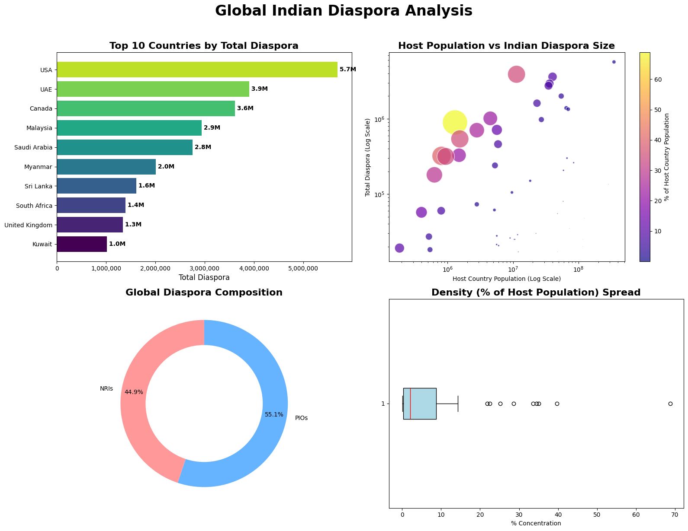

# Food Security and Safety for Indians and the Global Diaspora: A Predictive Climate-Demographic Model

*By Tanmoy*  
*Published: September 2026*

---

## 1. Introduction

Food security and safety represent two of the most critical challenges of the 21st century. For India—the world's most populous nation—and its non-resident and origin populations scattered across the globe, the vulnerability of the food supply chain is doubly complex. 

India's agricultural system is heavily dependent on predictable monsoon patterns, stable ambient temperatures, and groundwater reserves. However, global warming is driving increased climate volatility, extreme heat events during crop maturation, and altered rainfall distributions. Simultaneously, the global Indian diaspora (exceeding 32 million Non-Resident Indians and Persons of Indian Origin) remains heavily dependent on food exports from India—ranging from specialized rice varieties (such as Basmati) to pulses, spices, and processed staple foods.

In this analysis, we present a mathematical modeling framework to predict food yield losses against population trajectory and evaluate how climate impacts within India reverberate through global diaspora food supply chains.

---

## 2. Mathematical Predictive Model: Yield Decay vs. Demographic Growth

To forecast the future state of food security, we construct a coupled predictive model integrating **demographic projection** and **climate-driven agricultural yield loss**.

### 2.1 Population Projection Model

Let $P(t)$ represent the total Indian population (domestic plus diaspora reliant on Indian staple exports) at year $t$, where $t_0$ is the baseline year (2025). Using a logistic growth model to reflect demographic transition:

$$P(t) = \frac{K \cdot P_0}{P_0 + (K - P_0) e^{-r (t - t_0)}}$$

Where:
* $P_0$ = Baseline population ($\approx 1.45 \times 10^9$ domestic + diaspora demand equivalent)
* $K$ = Estimated carrying capacity/population ceiling ($\approx 1.70 \times 10^9$)
* $r$ = Intrinsic rate of population growth ($\approx 0.0085 \text{ yr}^{-1}$)

The total caloric food demand $D(t)$ (in metric tons of grain equivalent per year) is defined as:

$$D(t) = P(t) \cdot c \cdot (1 + \phi)$$

Where $c$ is the average annual per capita grain requirement ($\approx 0.22 \text{ metric tons/person/year}$) and $\phi$ is the safety waste/post-harvest loss coefficient ($\phi \approx 0.15$).

---

### 2.2 Climate-Induced Agricultural Yield Decay Model

Agricultural yield $Y(t)$ is modeled as a function of temperature anomaly $\Delta T(t)$ above pre-industrial levels and water stress coefficient $W(t)$:

$$Y(t) = Y_0 \cdot \prod_{i \in \{\text{rice, wheat, pulses}\}} w_i \cdot \left[ 1 - \alpha_i \cdot \Delta T(t) - \beta_i \cdot \max(0, W(t) - W_0) \right]$$

Where:
* $Y_0$ = Baseline agricultural yield potential ($\approx 330 \times 10^6 \text{ metric tons}$)
* $w_i$ = Proportion of crop $i$ in total output ($\sum w_i = 1$)
* $\alpha_i$ = Thermal sensitivity coefficient for crop $i$ ($\% \text{ loss per } ^{\circ}\text{C}$ warming):
  * $\alpha_{\text{wheat}} \approx 0.06 \text{ (6\% yield loss per } ^{\circ}\text{C} \text{ rise above threshold)}$
  * $\alpha_{\text{rice}} \approx 0.04 \text{ (4\% yield loss per } ^{\circ}\text{C} \text{ rise above threshold)}$
  * $\alpha_{\text{pulses}} \approx 0.05 \text{ (5\% yield loss per } ^{\circ}\text{C} \text{ rise above threshold)}$
* $\Delta T(t)$ = Projected temperature anomaly function:

$$\Delta T(t) = \Delta T_0 + \kappa \cdot (t - t_0)$$

with warming rate $\kappa \approx 0.03 \text{ }^{\circ}\text{C}/\text{year}$ under moderate emission scenarios (SSP2-4.5).

---

### 2.3 Net Food Balance Index ($\Omega(t)$)

We define the Food Security Balance Index $\Omega(t)$ as the ratio of projected yield output to total required consumption:

$$\Omega(t) = \frac{Y(t)}{D(t)} = \frac{Y_0 \cdot \left[ 1 - \bar{\alpha} \cdot (\Delta T_0 + \kappa (t - t_0)) \right]}{\left( \frac{K \cdot P_0}{P_0 + (K - P_0) e^{-r(t - t_0)}} \right) \cdot c (1 + \phi)}$$

* When $\Omega(t) > 1.10$: Food surplus exists; export buffer is secure for the global diaspora.
* When $1.00 \le \Omega(t) \le 1.10$: Margins are thin; domestic price shocks occur.
* When $\Omega(t) < 1.00$: Structural deficit occurs, necessitating export bans and strategic reserve depletion.

---

## 3. Global Indian Diaspora Dataset

The food security of overseas Indians is intrinsically linked to domestic agricultural policy and trade restrictions (such as non-basmati rice export curbs). The following dataset details the concentration of Non-Resident Indians (NRIs) and Persons of Indian Origin (PIOs) across 50 host nations.

```csv
Country,NRIs,PIOs,Total_Diaspora,Host_Country_Population,%_of_Host_Pop
USA,1920000,3770000,5690000,347694430,1.64
UAE,3890000,10000,3900000,11305020,34.50
Canada,1751610,1859680,3611290,40118870,9.00
Malaysia,185000,2755000,2940000,36116760,8.14
Saudi Arabia,2750000,0,2750000,34841920,7.89
Myanmar,2660,2000000,2002660,54421240,3.68
Sri Lanka,7500,1602500,1610000,23213060,6.94
South Africa,74057,1315943,1390000,64978480,2.14
United Kingdom,369000,971000,1340000,69545810,1.93
Kuwait,1010000,2356,1012356,4500000,22.50
Australia,350000,626000,976000,27084160,3.60
Mauritius,10500,884000,894500,1300000,68.81
Oman,710000,2000,712000,5671458,12.55
Qatar,705000,0,705000,2800000,25.18
Trinidad & Tobago,11500,528500,540000,1540000,35.06
Singapore,160000,300000,460000,5905748,7.79
Bahrain,323908,3899,327807,1500000,21.85
Guyana,1500,320000,321500,810000,39.69
Fiji,2283,313798,316081,940000,33.63
France (inc. Reunion),29000,271159,300159,66655520,0.45
Germany,208000,52864,260864,84192410,0.31
Italy,167333,39170,206503,58865750,0.35
Suriname,500,179500,180000,630000,28.57
Netherlands,15000,135000,150000,18275460,0.82
Indonesia,14817,120000,134817,285871330,0.05
Israel,20000,85000,105000,9624280,1.09
Kenya,20000,60000,80000,58171930,0.14
Jamaica,5000,68000,73000,2800000,2.61
Ireland,30000,31386,61386,5200000,1.18
Bhutan,60000,0,60000,800000,7.50
Guadeloupe,180,57000,57180,400000,14.30
Spain,45000,10000,55000,47719600,0.12
New Zealand,80000,160000,240000,5300000,4.53
Japan,46262,1548,47810,122560220,0.04
Tanzania,5000,30000,35000,72469700,0.05
Zambia,5000,25000,30000,22388580,0.13
Belgium,17438,11396,28834,11747220,0.25
Norway,16890,10955,27845,5652989,0.49
Maldives,27065,135,27200,520000,5.23
Switzerland,17059,8996,26055,9007798,0.29
Portugal,21000,4000,25000,10383350,0.24
Philippines,15000,10000,25000,117030070,0.02
Sweden,22000,3000,25000,10651980,0.23
Finland,8245,13114,21359,5621739,0.38
Denmark,17460,3187,20647,6023520,0.34
Congo (DRC),15000,5000,20000,116253260,0.02
Saint Lucia,550,18600,19150,185000,10.35
Malta,18000,250,18250,540000,3.38
Iraq,17100,4,17104,47699460,0.04
Jordan,16897,153,17050,12035110,0.14
```

---

## 4. Key Findings & Analysis

### 4.1 Vulnerability of the GCC Region
Countries like the United Arab Emirates (34.50% Indian diaspora share), Qatar (25.18%), Kuwait (22.50%), and Bahrain (21.85%) maintain high concentrations of Indian populations. These nations import over 80% of their staple food requirements. When extreme climate events trigger agricultural shortfalls in South Asia, domestic protectionist policies (e.g., export bans on rice or wheat) directly shock food inflation and security in these host countries.

### 4.2 Thermal Stress on the Indo-Gangetic Plain
Our agricultural decay model predicts that a $1.5^{\circ}\text{C}$ temperature increase by 2040 could lead to an estimated:
* **8% to 12% drop** in wheat output in Northern India due to terminal heat stress during the grain-filling stage.
* **5% to 10% reduction** in monsoon rice production caused by erratic spatial distribution of rainfall.

### 4.3 Food Safety Implications
Rising ambient temperatures pose major challenges for food safety:
1. **Aflatoxin and Mycotoxin Contamination:** Higher temperatures and irregular moisture increase fungal proliferation in stored grains and groundnuts.
2. **Cold-Chain Disruptions:** Global supply chains for perishable goods (fruits, vegetables, dairy) face elevated spoilage risks during storage and transit.

---

## 5. Strategic Mitigation Pathways

To maintain $\Omega(t) \ge 1.10$ through 2050, several key interventions are required:

1. **Crop Diversification & Climate-Resilient Cultivars:** Transitioning a portion of acreage from water-intensive rice/wheat to biofortified, heat-tolerant millets (*Ragi, Jowar, Bajra*).
2. **Precision Agriculture & Drip Irrigation:** Lowering the water stress coefficient $W(t)$ through targeted micro-irrigation.
3. **Bilateral Diaspora Food Reserves:** Establishing strategic grain reserves in key destination regions (GCC, North America, Southeast Asia) to buffer against export restrictions during climate shock years.

---

## 6. Conclusion

Food security for Indians at home and across the global diaspora depends on managing climate risk and demographic pressure. By applying quantitative models to agricultural and demographic trends, policymakers can anticipate supply gaps, modernize cold-chain logistics, and ensure equitable access to safe food worldwide.
