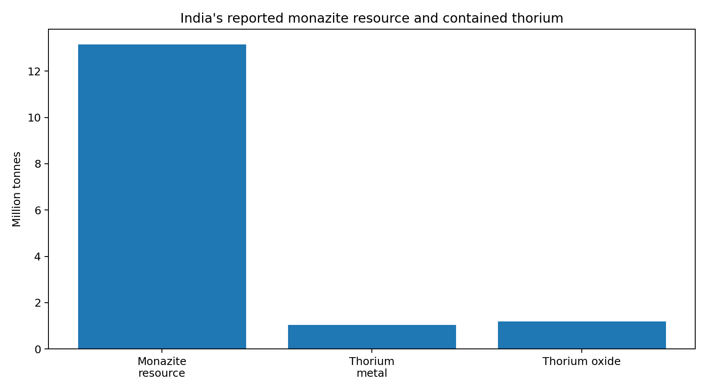
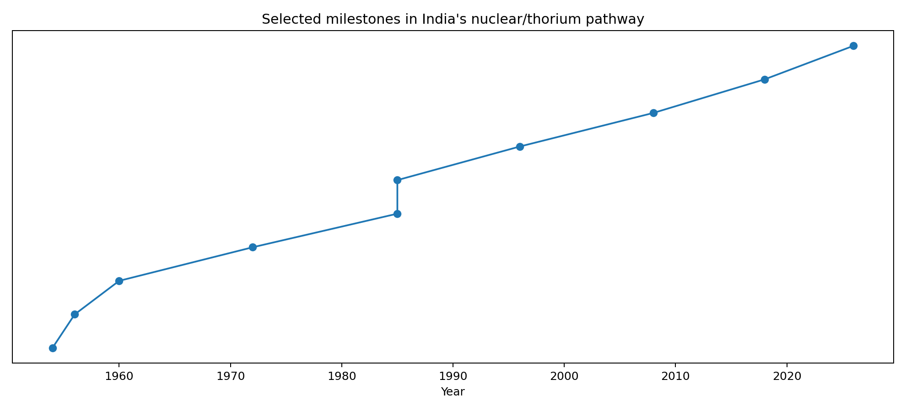
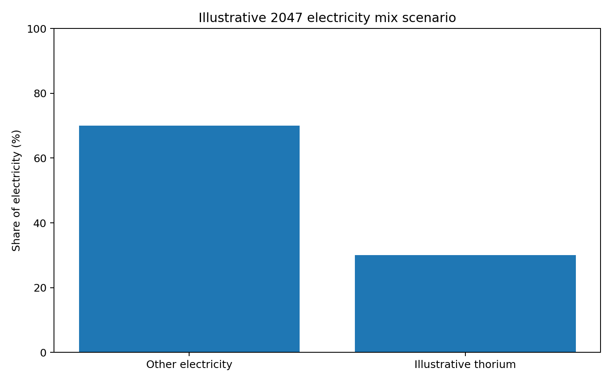
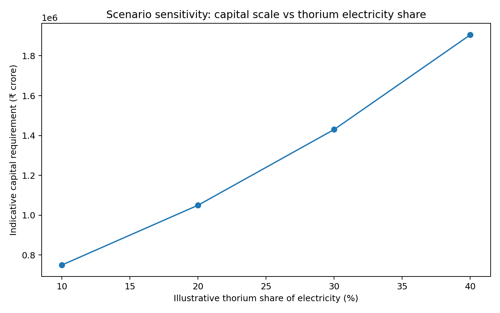

# India's Thorium Opportunity
## From monazite sands to a long-term nuclear fuel cycle

**By Tanmoy**

> **Research blog — September 2026**  
> This article separates documented facts from illustrative future scenarios.

---

## 1. Why thorium matters to India

India has pursued a three-stage nuclear programme because it has relatively limited uranium resources but substantial thorium resources. The programme is designed around natural-uranium PHWRs, followed by fast breeder reactors, and ultimately advanced systems using thorium-derived uranium-233.

Thorium-232 is **fertile, not fissile**. It must be converted through neutron capture and radioactive decay into uranium-233 before it can serve as the principal fissile material in a thorium fuel cycle. BARC explicitly describes this as a central feature of India's three-stage strategy. citeturn1search1

The central question is therefore not simply whether India has thorium. It is whether India can turn that resource into a commercially competitive, scalable and closed nuclear fuel cycle.

---

## 2. India's thorium resource

The Atomic Minerals Directorate / Department of Atomic Energy reports approximately **13.15 million tonnes of in-situ monazite** in Indian coastal and inland placer deposits. The same official estimate says this contains approximately **1.04 million tonnes of thorium metal**, or about **1.18 million tonnes of thorium oxide (ThO₂)**. citeturn0search17



It is important not to describe the entire 13.15 Mt as pure thorium. Monazite is a thorium-bearing mineral that also contains rare-earth elements and uranium. BARC notes Indian monazite deposits containing roughly 8–10% thorium. citeturn1search1

So the resource chain is better represented as:

$$
\text{monazite}
\rightarrow \text{thorium-bearing material}
\rightarrow \mathrm{ThO_2}
\rightarrow {}^{233}\mathrm{U}
\rightarrow \text{fission energy}
$$

---

## 3. Why thorium is not simply “free nuclear fuel”

The key transformation is:

$$
{}^{232}\mathrm{Th}(n,\gamma)
\rightarrow {}^{233}\mathrm{Th}
\rightarrow {}^{233}\mathrm{Pa}
\rightarrow {}^{233}\mathrm{U}
$$

The uranium-233 is fissile. This means a substantial thorium economy requires a reactor environment capable of producing fissile material, sophisticated fuel fabrication, irradiation, reprocessing and recycling.

That is why India's programme is sequential rather than simply building thousands of thorium reactors immediately.

---

# 4. A research programme spanning generations

India's Department of Atomic Energy was established in 1954, while the Atomic Energy Commission received expanded executive and financial powers in 1958. citeturn1search4

India subsequently developed research reactors and facilities that provided the scientific base for the later stages of its nuclear programme.



### Selected milestones

| Year | Milestone | Significance |
|---:|---|---|
| 1954 | Department of Atomic Energy | Institutional foundation |
| 1956 | Apsara criticality | First Indian research reactor |
| 1960 | CIRUS commissioned | Major neutron/research platform |
| 1972 | PURNIMA | Fast-reactor physics studies |
| 1985 | Dhruva commissioned | High-flux research capability |
| 1985 | FBTR commissioned | Fast-breeder technology platform |
| 1996 | KAMINI commissioned | U-233-fuelled research reactor |
| 2008 | AHWR Critical Facility | AHWR physics validation |
| 2018 | Apsara-U criticality | Modernised research capability |
| 2026 | PFBR first criticality | Major Stage-II milestone |

BARC records the criticality of Apsara in 1956, CIRUS in 1960 and Dhruva in 1985; it also describes KAMINI as a U-233-fuelled research reactor and the AHWR Critical Facility as part of the thorium development effort. citeturn1search3turn1search1

---

# 5. What India has actually achieved

The thorium programme has not yet produced a large commercial fleet of thorium reactors. But it is incorrect to say that India has done no thorium research.

BARC reports work on:

- thoria production from monazite;
- thoria-pellet fuel fabrication;
- thorium irradiation experiments;
- thorium fuel bundles in PHWRs;
- thorium blankets in FBTR;
- thorium-plutonium MOX experiments;
- recovery of U-233 from irradiated thorium;
- use of recovered U-233 in KAMINI;
- AHWR design and critical-facility experiments.

citeturn1search1

This is best understood as **fuel-cycle technology development**, not yet mass deployment.

---

# 6. AHWR — the bridge to large-scale thorium use

The **Advanced Heavy Water Reactor (AHWR)** is a 300 MWe technology-demonstration design. BARC describes it as a vertical pressure-tube reactor using boiling light-water cooling and heavy-water moderation, with passive safety characteristics and features intended to demonstrate thorium utilisation. It can also use process steam and waste heat for desalination. citeturn0search0

The concept is essentially a bridge:

```text
Thorium resource
      ↓
Fuel fabrication
      ↓
Irradiation
      ↓
U-233 production
      ↓
Reprocessing
      ↓
Fuel recycling
      ↓
Commercial-scale thorium systems
```

---

# 7. Why the 2026 PFBR milestone matters

On 6 April 2026, India's 500 MWe Prototype Fast Breeder Reactor at Kalpakkam achieved first criticality. The Government of India describes this as a major step in the three-stage nuclear programme. citeturn1search5turn1search9

This is relevant to thorium because India's Stage-II fast-breeder programme is intended to build fissile-material inventories that can support the later thorium stage.

In simplified form:

$$
\text{PHWR}
\rightarrow
\text{plutonium}
\rightarrow
\text{fast breeder}
\rightarrow
\text{fissile inventory}
\rightarrow
\text{thorium/U-233 systems}
$$

Thus, a milestone in fast-breeder deployment can be a milestone in the **preconditions** for large-scale thorium utilisation.

---

# 8. How much future electricity could thorium provide?

There is no authoritative current figure saying that thorium will provide exactly 10%, 20%, 30% or 50% of India's electricity in 2047.

The eventual share depends on reactor technology, construction speed, fuel-cycle capacity, economics, regulation and competition from other energy sources.

So this blog uses an **illustrative scenario**, not a forecast.

Suppose India's 2047 electricity requirement were:

$$
E_{2047}=2500\ \mathrm{TWh/year}
$$

This is an assumption for scale analysis, not an official Government of India forecast.

If thorium-derived nuclear generation supplied 30%:

$$
E_{Th}=0.30\times2500
=750\ \mathrm{TWh/year}
$$

At a hypothetical 90% capacity factor:

$$
P=\frac{750}{8760\times0.90}
\approx95.1\ \mathrm{GW}
$$

So the scenario corresponds to approximately **95 GW of average installed-equivalent nuclear capacity**.



Again: **95 GW is a scenario calculation, not a government target for thorium.**

---

# 9. How many reactors would that mean?

Using a 300 MWe AHWR-sized unit simply as a reference scale:

$$
N=\frac{95.1}{0.300}\approx317
$$

So a 30% scenario would be roughly equivalent to:

$$
\boxed{317\times300\text{-MWe-equivalent units}}
$$

Actual future reactors would not necessarily be 300 MWe. A fleet could contain larger breeders, advanced reactors and other designs, so this number is **not a proposed reactor count**.

---

# 10. What might such a build-out cost?

A thorium reactor fleet does not currently have a reliable commercial price tag in India. The safest way to estimate its scale is therefore to use a transparent benchmark and label it as such.

Government data from 2026 list several 700 MW PHWR projects at around ₹20,000–₹22,000 crore for two-unit projects. For example, Kaiga 5&6 is listed at ₹21,000 crore and Gorakhpur 1&2 at ₹20,594 crore. citeturn1search2

That is roughly:

$$
\frac{₹21,000\text{ crore}}{1400\text{ MW}}
\approx₹15\text{ crore/MW}
$$

Using ₹15 crore/MW only as a **benchmark**:

$$
95,100\text{ MW}\times₹15\text{ crore/MW}
\approx₹1.43\times10^6\text{ crore}
$$

or about:

$$
\boxed{₹14.3\text{ trillion}}
$$

This is **not** a quote for a thorium programme. A real programme could cost materially more or less because advanced thorium reactors, fuel fabrication, reprocessing, breeder infrastructure, financing and first-of-a-kind engineering have different cost structures.

---

# 11. Sensitivity: the share changes the scale dramatically



| Illustrative thorium share | Generation | Average capacity | 300-MWe equivalents |
|---:|---:|---:|---:|
| 10% | 250 TWh/yr | ~31.7 GW | ~106 |
| 20% | 500 TWh/yr | ~63.4 GW | ~212 |
| 30% | 750 TWh/yr | ~95.1 GW | ~317 |
| 40% | 1,000 TWh/yr | ~126.8 GW | ~423 |

These are scenario calculations based on the same illustrative 2,500 TWh/year demand and 90% capacity factor.

---

# 12. Put that against India's nuclear expansion target

As of February 2026, India had 24 commercial nuclear reactors (excluding RAPS-1) with a combined capacity of 8,780 MW. The government has a roadmap for approximately **100 GW of nuclear capacity by 2047**. citeturn0search7

The scale-up implied by the target is:

$$
\frac{100}{8.78}\approx11.4
$$

So the entire Indian nuclear fleet is intended to become roughly eleven times its current capacity by 2047.

A large thorium contribution would have to fit within—or expand—the industrial ecosystem needed for that wider nuclear build-out.

---

# 13. Electricity is not total energy

A 30% share of electricity is **not** the same as 30% of India's total energy consumption.

India uses energy for:

- electricity;
- road transport;
- aviation;
- shipping;
- industrial heat;
- steel;
- cement;
- chemicals;
- hydrogen;
- buildings.

Therefore, the cleanest way to describe a future thorium contribution is initially as a **percentage of electricity generation**.

Nuclear heat could potentially also support desalination, hydrogen and industrial heat. BARC specifically identifies desalinated water as a potential AHWR co-product. citeturn0search0

---

# 14. Energy density: enormous in theory, harder in practice

Nuclear fission releases energy at an extraordinary energy density. The basic physical relationship is:

$$
E=mc^2
$$

but a practical nuclear system does not convert all fuel mass directly into energy.

Real systems have neutron losses, fuel-cycle losses, reactor conversion efficiency, downtime, decay heat and waste-management requirements.

Therefore:

> **A huge geological resource is not automatically a huge electricity supply.**

The conversion chain is the real engineering problem.

---

# 15. The economics of a thorium fuel cycle

A simplified levelised-cost expression is:

$$
LCOE=\frac{I\cdot CRF+F+O\&M+D}{E_{annual}}
$$

where:

- $I$ = initial capital investment;
- $CRF$ = capital-recovery factor;
- $F$ = fuel-cycle cost;
- $O\&M$ = operation and maintenance;
- $D$ = decommissioning and waste-related costs;
- $E_{annual}$ = annual electricity generation.

Thorium's economic case therefore cannot be judged simply by asking whether thorium ore is cheap.

The relevant system is:

$$
\boxed{\text{resource}+\text{breeding}+\text{fuel cycle}+\text{reactors}+\text{waste management}}
$$

---

# 16. The main bottlenecks

## Fuel-cycle complexity

Thorium requires a carefully managed conversion to U-233 and, for a closed cycle, recycling and reprocessing.

## Reprocessing

The ability to recover useful fissile material efficiently is central to a mature thorium cycle.

## Capital intensity

Nuclear power has high upfront capital requirements even before adding a novel fuel cycle.

## Construction speed

A resource only becomes an energy asset when reactors and associated infrastructure are actually built and operated.

## Regulation and safety

Advanced reactors require extensive safety demonstration and licensing.

## Competition

Solar, wind, hydro, storage, transmission, efficiency improvements and other nuclear technologies will all compete for capital and grid space.

---

# 17. Three statements that should not be confused

### Fact

India has an officially estimated 13.15 Mt in-situ monazite resource containing about 1.04 Mt thorium metal. citeturn0search17

### Fact

India has conducted decades of thorium fuel-cycle research, including thoria fuel work, irradiation, U-233 recovery, KAMINI and AHWR development. citeturn1search1

### Future possibility

A major commercial thorium contribution to Indian electricity is technically conceivable, but its eventual scale, timing and cost remain uncertain.

Keeping these categories separate is essential for a serious analysis.

---

# 18. A possible mature system

```text
             URANIUM
                │
                ▼
        ┌────────────────┐
        │ Stage-I PHWRs  │
        └───────┬────────┘
                │
                ▼
             PLUTONIUM
                │
                ▼
        ┌────────────────┐
        │ Fast Breeders  │
        └───────┬────────┘
                │
                ▼
          FISSILE INVENTORY
                │
                ▼
       ┌──────────────────┐
       │ THORIUM BLANKETS │
       └────────┬─────────┘
                │
                ▼
              U-233
                │
                ▼
       ┌──────────────────┐
       │ THORIUM REACTORS │
       └────────┬─────────┘
                │
        ┌───────┼─────────┐
        ▼       ▼         ▼
    ELECTRICITY  HEAT  DESALINATION
```

This is the strategic logic behind India's three-stage programme: convert limited uranium resources into a larger long-term energy resource base, eventually making use of abundant thorium.

---

# 19. Final assessment

India's thorium story is neither a simple “energy miracle” nor a failed experiment.

It is a **long-duration technology programme** built around a genuine resource advantage and a difficult engineering problem.

The resource is substantial:

$$
13.15\text{ Mt monazite}
\rightarrow
1.04\text{ Mt Th metal}
$$

The research history is substantial as well: from Apsara and CIRUS through Dhruva, KAMINI, thorium fuel experiments, the AHWR programme and the 2026 PFBR milestone. citeturn1search1turn1search3turn1search5

But the distance between:

$$
\boxed{\text{“India has thorium”}}
$$

and:

$$
\boxed{\text{“thorium supplies a major fraction of India's electricity”}}
$$

is enormous.

Under one illustrative scenario, 30% of a 2,500 TWh/year 2047 electricity system would mean 750 TWh/year from thorium-derived generation, roughly 95 GW at a 90% capacity factor. A simple existing-PHWR cost benchmark places the corresponding capital scale in the **₹14 trillion range**, before accounting for the special costs of a mature closed thorium fuel cycle.

That number should not be read as a forecast. It demonstrates the scale of the industrial transformation required.

The most defensible conclusion is:

> **India has an unusually large thorium resource and decades of relevant nuclear research. The decisive future question is whether the country can convert those foundations into a commercially competitive, scalable, safe and reliable thorium fuel cycle.**

---

# Data files included

- `india_thorium_resources.csv`
- `thorium_milestones.csv`
- `thorium_2047_scenario.csv`
- `thorium_sensitivity.csv`

## Graphs

- `india_thorium_resources.png`
- `thorium_research_timeline.png`
- `thorium_2047_share_scenario.png`
- `thorium_cost_sensitivity.png`

---

# Sources

1. Department of Atomic Energy / Atomic Minerals Directorate — Indian monazite and thorium resource estimate. citeturn0search17
2. Bhabha Atomic Research Centre — Thorium Fuel Cycle. citeturn1search1
3. Bhabha Atomic Research Centre — Advanced Heavy Water Reactor. citeturn0search0
4. BARC — Research reactors and historical milestones. citeturn1search3
5. Department of Atomic Energy — History of India's atomic-energy programme. citeturn1search4
6. Government of India — PFBR first criticality, April 2026. citeturn1search5
7. Government of India — Nuclear Energy Mission / 100 GW by 2047. citeturn0search1turn0search7
8. Government of India — Current reactor projects and reported project costs. citeturn1search2

---

## Methodology note

Historical facts are distinguished from calculations. The 2,500 TWh/year 2047 demand, 30% thorium share and 90% capacity factor are illustrative assumptions. The capital estimate is a benchmark exercise based on recent PHWR project costs and is **not a quoted cost for a thorium reactor fleet**. Actual costs could differ substantially because of first-of-a-kind engineering, financing, construction schedules, fuel fabrication, reprocessing, breeder infrastructure, waste management and regulatory requirements.
